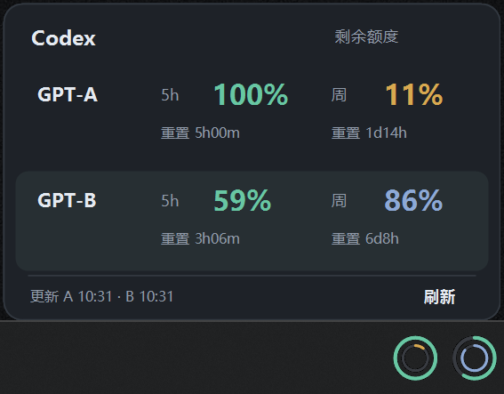
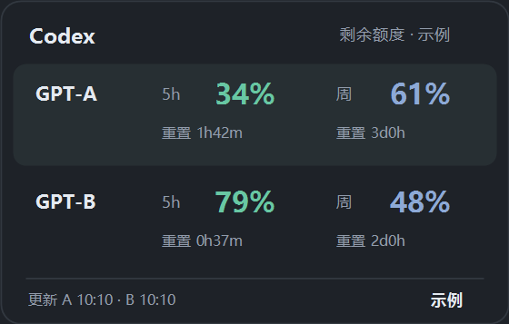
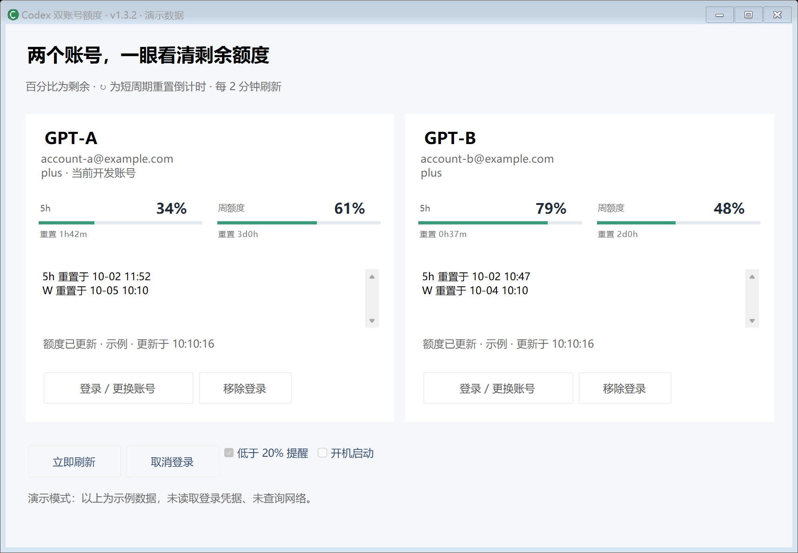

# Codex Quota Tray

A Windows taskbar monitor that keeps two Codex accounts' remaining quotas visible at a glance.

**Windows 11 · C# / .NET 8 · MIT · Experimental v1.3.7**

**双账号剩余额度，任务栏一眼看清，悬停再看详情。**

写代码时看一眼圆环，就能知道哪个账号还有余量；停留鼠标即可比较短周期、周额度与重置时间，方便安排任务和决定何时手动切换账号。



上图由用户提供，仅展示 A/B 标签和额度。下方演示图片使用示例账号及数据。项目由个人维护，与 OpenAI 无隶属关系。

## 为什么使用 Codex Quota Tray

| 优势 | 日常使用中的价值 |
| --- | --- |
| **额度始终在视线内** | 两组小圆环常驻任务栏，不占用一个完整窗口；外圈看短周期，内圈看周额度。 |
| **双账号并排比较** | A 在左、B 在右，低余额变为琥珀色，方便判断接下来使用哪个账号。 |
| **详情随手可查** | 悬停即显示百分比、重置倒计时与更新时间；移开鼠标自动收起，保持工作区简洁。 |
| **开发与监控各自独立** | 两个监控账号使用独立登录目录，查看它们的额度无需更改开发用 Codex 的登录；切换开发账号由用户手动完成。 |
| **关掉 Codex 也能继续查看** | 系统任务独立常驻，支持开机启动；关闭完整面板后保留圆环与托盘。 |
| **适合已有任务栏工具的桌面** | 自动避让 TrafficMonitor 和系统控件，适配深浅主题与缩放；用户实机切屏测试已通过。 |
| **数据留在本机** | 凭据使用 Windows DPAPI 加密封存，查询通过已安装的 CLI 进行，不搭建额外中转服务。 |

适合同时使用两个 Codex 账号、需要了解额度余量和重置时间的 Windows 用户。显示的是服务返回的额度快照；它不会自动切换账号或预测每个任务的消耗。

## 快速体验

先安装下方列出的 .NET 8 SDK。[下载当前主分支源码](https://github.com/Leo-6-maker/codex-quota-tray/archive/refs/heads/main.zip)并解压到可写目录后，双击对应脚本：

| 脚本 | 用途 |
| --- | --- |
| **`Demo.cmd`** | 无需登录或安装 Codex CLI，使用示例数据查看圆环、悬停卡片和完整面板；不注册常驻任务，不读写账号凭据。 |
| **`Start.cmd`** | 正式使用，需要 Codex CLI；首次自动编译并运行离线自检，再启动常驻监控。点击托盘图标分别授权 A、B。 |

两个脚本在 `dist` 不存在时都会自动编译；编译完成后的再次启动直接使用已有程序。脚本不会自动下载依赖，也不要求管理员权限。

更新源码后运行 `build.ps1 -SelfTest` 重新编译，确保使用新版本。

### 三种查看方式

**常驻圆环：** 常驻区域不显示文字或数字，用颜色和弧长查看余量。


**悬停卡片：** 按账号分行展示短周期与周额度，停在哪一圈就突出哪个账号。



**完整面板：** 查看账号身份、额度详情，并管理登录、提醒与开机启动。



## 功能

- 左右两组同心圆环分别代表 GPT-A / GPT-B；外圈表示短周期剩余额度，内圈表示周剩余额度。
- 默认短周期通常为 5h，实际时长按服务返回的数据显示；百分比均为**剩余**。
- 悬停显示迷你卡片：两账号额度、重置倒计时、各自更新时间。
- 低于 20% 时对应圆环变为琥珀色；数据过期变灰，保留上次快照。
- 每两分钟刷新；低余额提醒可关闭。
- 任务栏圆环避让 TrafficMonitor 和系统控件；仅显示在主屏任务栏。
- 通过当前用户的系统任务独立运行，支持开机启动；关闭面板后保留托盘。

## 环境

- Windows 11 x64，支持 .NET 8 Windows Desktop Runtime。
- 从源码编译需要 [.NET 8 SDK](https://dotnet.microsoft.com/download/dotnet/8.0)。SDK 已包含运行所需组件。
- 正式监控需安装 [Codex CLI](https://github.com/openai/codex)，并且两个监控账号分别具备 Codex 使用权限；演示不需要 CLI 或账号。

程序优先使用 `CODEX_QUOTA_CLI` 指定的原生 `codex.exe`，然后查找 npm 安装目录和 PATH。仅安装 npm 包时，程序会查找包内的原生可执行文件。如果无法自动找到，在启动程序的环境中设置 `CODEX_QUOTA_CLI` 为该文件的完整路径。

## 从源码运行

在 PowerShell 中运行：

```powershell
git clone https://github.com/Leo-6-maker/codex-quota-tray.git
cd codex-quota-tray
./Start.cmd
```

`Start.cmd` 和 `Demo.cmd` 已包含仅对当前脚本进程生效的执行策略设置。也可手动编译并运行离线自检：

```powershell
./build.ps1 -SelfTest
```

保持 `dist` 和它的父目录位置不变，放在当前用户可写的位置。正式启动器必须位于 `dist` 内；普通启动会注册或更新本用户的 `CodexQuotaTray-<Windows SID>` 系统任务，并立即启动后台监控。默认不开机自启，可在面板勾选“开机启动”。无需管理员权限。

启用开机启动后，登录延迟 10 秒启动；任务栏仍未就绪或暂时拒绝创建圆环时，保留托盘并自动重试挂载。进程异常退出时，系统任务每隔 1 分钟最多重启 3 次。更新版本后启动一次 `Start.cmd`，以更新任务设置。

需要普通应用图标入口时，构建后运行 `powershell -NoProfile -ExecutionPolicy Bypass -File .\scripts\create-shortcuts.ps1`，会在应用文件夹、桌面和开始菜单创建快捷方式。双击入口或 `Start.cmd` 会启动监控并打开账号面板；再次点击会打开已有面板，保持一个后台进程。开机自动启动仍保持后台常驻，关闭面板只会收起。

首次使用点击托盘图标打开完整面板，分别为 A、B 点击“登录 / 更换账号”，在浏览器中选择对应账号。两个位置需要分别授权，授权后核对面板中的邮箱。ChatGPT 网页上的多账号登录不会自动授权给本工具。

悬停查看额度，双击圆环或点击托盘图标打开面板。关闭面板只是收起；右键托盘选择“退出”结束监控。Windows 可将托盘图标放进隐藏区，请在任务栏设置中调整。

本工具只查看额度；开发用 Codex 的账号切换仍由用户手动完成。

## 账号数据与隐私

程序通过已安装 Codex CLI 的 app-server 查询 `account/read` 和 `account/rateLimits/read`，不发送模型推理请求。

- 两个监控位置使用独立的 `CODEX_HOME`：`data/accounts/A` 与 `data/accounts/B`，不写入开发用 Codex 的账号目录。
- 查询或登录期间，受限目录中短暂存在 `auth.json`。操作结束后停止查询进程，通过 Windows DPAPI CurrentUser 加密为 `auth.dpapi`，并移除工作文件。
- DPAPI 凭据绑定 Windows 用户及目录；移动安装目录后可能需要重新授权，不能当作可迁移账号备份。
- `data/state.json` 包含邮箱、额度和偏好；`data/health.json` 含运行状态。不要上传整个 `data` 目录或未经检查的诊断文件。
- 当前开发账号标记只读本地认证文件中的邮箱；仅存在于系统凭据存储中的登录不会显示标记。
- 不读取 Chrome Cookie，不搭建云端中转服务。协议正文、OAuth 地址和 token 不写入诊断日志。
- 强制结束、断电或加密失败时可能留下受限工作文件，下一次启动会尝试恢复封存。

本工具只在当前用户目录未占用时尝试迁移旧版同名工具的数据；如果电脑曾使用本工具，首次运行可能保留既有账号设置。

## 兼容性与已知限制

任务栏圆环采用 Windows 原生子控件；悬停详情卡片是独立的无激活窗口。Windows 11 任务栏内部结构不是稳定扩展接口，系统更新、任务栏替换软件可能影响挂载。

切屏时如任务栏正在重建或没有可靠空位，圆环保持隐藏并自动重试；托盘仍可打开完整面板。不会退回屏幕顶部浮窗，不会调整 TrafficMonitor 的位置或配置。

v1.3.2 已在一台 Windows 11 设备上验证实际任务栏显示、透明背景和 TrafficMonitor 避让；缩放消息、失效快照、父窗口销毁后的恢复通过模拟检查。2026-10-02，用户报告外接显示器与笔记本屏幕切换的实机测试已完成并通过。此结果来自用户当前设备，不代表所有硬件组合；Windows 10、ARM64 和多显示器分别显示圆环尚未验证。

Codex app-server 协议以开发时 CLI 0.114.0 为基线，CLI 更新后可能需要调整。网络失败时显示过期快照，不把失败当作额度归零。

## 检查与贡献

```powershell
./build.ps1 -SelfTest
./Demo.cmd
./scripts/check-publish.ps1
```

自动构建运行离线自检，不登录账号、不查询真实额度，也不注册系统任务。`Demo.cmd` 显示示例数据，不创建认证客户端；退出演示也不会整理真实账号凭据。演示与真实监控同时运行时，会在同一任务栏位置绘制示例圆环；体验完请从演示的托盘菜单退出，以继续查看真实额度。

桌面显示和隔离认证检查见 [开发说明](docs/DEVELOPMENT.md)。提交问题时请提供 Windows 版本、缩放比例、显示器切换方式和 CLI 版本，并遮盖账号信息。请勿提交凭据、OAuth 链接或原始协议日志。

## 卸载

先在托盘右键退出，再按当前用户删除本工具的系统任务：

```powershell
$taskSid = [System.Security.Principal.WindowsIdentity]::GetCurrent().User.Value
Unregister-ScheduledTask -TaskName ('CodexQuotaTray-' + $taskSid) -Confirm:$false
```

随后可手动删除工具目录。`data` 含本工具的账号凭据；如需保留登录，请保留原位置。此操作不会删除开发用 Codex 的账号。

## 许可与参考

本项目采用 [MIT License](LICENSE)。OpenAI、Codex、Windows 名称归各自权利人所有。

任务栏挂载设计参考 [TrafficMonitor](https://github.com/zhongyang219/TrafficMonitor)，本仓库不包含其源码或可执行文件。Codex CLI 作为外部安装依赖使用，不随本仓库分发。
